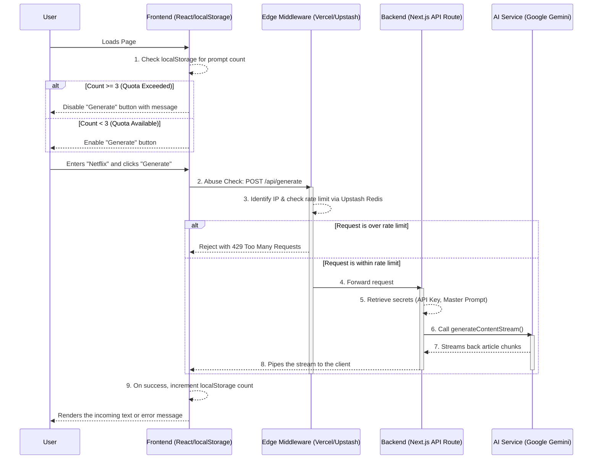

# AI Frontend System Design Article Generator

A full-stack Next.js application demonstrating a secure, streaming-first architecture for interacting with generative AI.

**Live Demo:** [Link to deployed Vercel URL]

## Key Features

- **Real-time Streaming**: Articles are streamed from the server token-by-token, providing an immediate, "ChatGPT-like" user experience
- **Secure, Server-Side Prompt Management**: The core prompt and the AI API key are kept securely on the backend, never exposed to the client, preventing unauthorized use or theft
- **Multi-Layered Security**:
  - **Abuse Prevention**: Edge-based rate limiting with Vercel Middleware and Upstash Redis protects the API from bots and brute-force attacks
  - **Usage Quota Management**: A client-side localStorage implementation provides a simple, user-friendly 3-prompt limit to control costs
- **UI**: Built with Tailwind CSS
- **Markdown Rendering**: The streamed output is parsed and rendered as rich text using react-markdown

## Architecture

### The Solution: An Edge-First, Secure Proxy with a Smart Client

This application uses Vercel Edge Middleware for security and a Next.js API Route as a secure proxy to the AI service. The client only ever communicates with our own backend, and malicious traffic is blocked at the Edge before it can consume expensive serverless resources.

### Data and Security Flow



## Tech Stack

- **Framework**: Next.js (App Router)
- **Language**: TypeScript
- **Styling**: Tailwind CSS
- **UI/Icons**: React, Lucide React, React Markdown
- **AI**: Google Gemini API
- **Security & Infrastructure**: Vercel Edge Middleware, Upstash Redis for rate limiting
- **Deployment**: Vercel

## Getting Started

### Prerequisites

- Node.js (v18.17+)
- npm/yarn

### Setup

1. **Clone & Install**

   ```bash
   git clone <repository-url>
   cd nextjs-fullstack-ai-fe-system-designer
   npm install
   ```

2. **Environment Variables**

   ```bash
   cp .env.example .env.local
   ```

   Add to `.env.local`:

   ```env
   # Get your API key from Google AI Studio: https://aistudio.google.com/
   GEMINI_API_KEY="your_google_gemini_api_key"

   # This is your secret, comprehensive prompt.
   # Use {{SYSTEM_NAME}} as a placeholder for user input.
   MASTER_PROMPT="... Write a ... frontend system design document for {{SYSTEM_NAME}}..."

   # Get your Redis credentials from your Upstash database dashboard
   UPSTASH_REDIS_REST_URL="your_upstash_redis_rest_url"
   UPSTASH_REDIS_REST_TOKEN="your_upstash_redis_rest_token"
   ```

3. **Run Development Server**

   ```bash
   npm run dev
   ```

   Open [http://localhost:3000](http://localhost:3000)

## Deployment

1. Push code to GitHub
2. Import repository into Vercel
3. Add environment variables in Vercel settings
4. Deploy automatically

## Author

**[Devi R](https://www.linkedin.com/in/devi-r-06bb94a7)**
